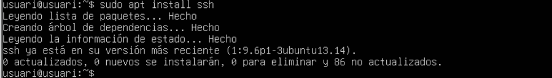
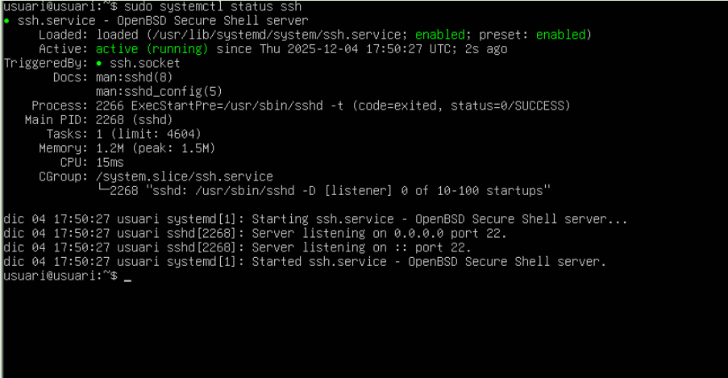

# T05: Accés remot 💻

Haurem de tenir **dues VM**, amb **dues interfícies de xarxa** cadascuna:  
- NAT  
- Host-Only  

Per tant, **DHCP activat** (`true`).  

A continuació, instal·larem **SSH**:

```bash
sudo apt upgrade && sudo apt update && sudo apt install ssh -y

```




---

També habilitarem i iniciarem el servei **SSH**:

```bash
sudo systemctl enable ssh
sudo systemctl start ssh

```

sudo systemctl status ssh


