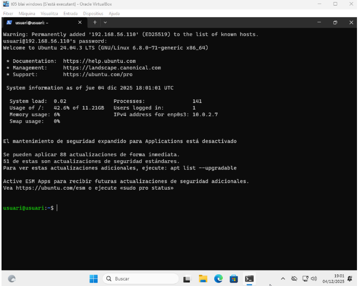
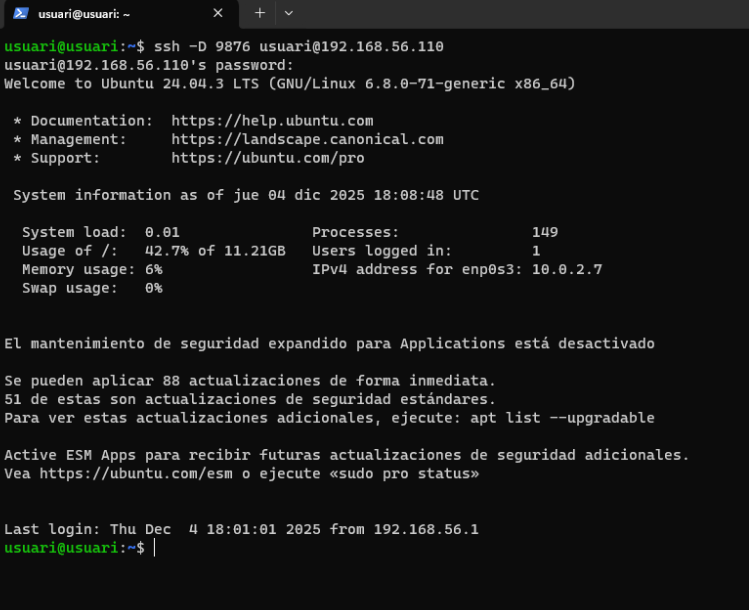
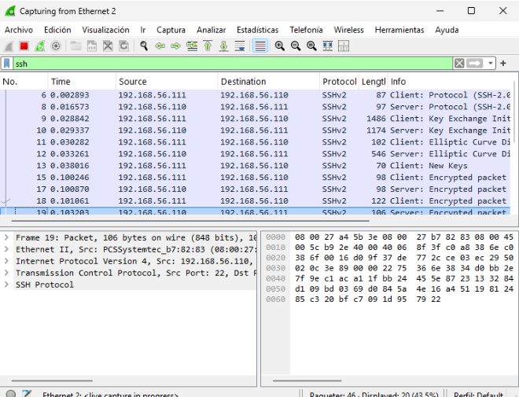

# T05: Accés remot 💻

Haurem de tenir **dues VM**, amb **dues interfícies de xarxa** cadascuna:  
- NAT  
- Host-Only  

Per tant, **DHCP activat** (`true`).  

A continuació, instal·larem **SSH**:

```bash
sudo apt upgrade && sudo apt update && sudo apt install ssh -y

```


---

També habilitarem i iniciarem el servei **SSH**:

```bash
sudo systemctl enable ssh
sudo systemctl start ssh

```

sudo systemctl status ssh


---

Un cop hem identificat la **IP del nostre servidor**, haurem d’instal·lar i configurar un **client Windows**.  

Després, accedirem al terminal **PowerShell** i, des d’allà, ens podrem connectar al servidor mitjançant **SSH**:

```powershell
ssh usuari@[ip]

```



---

Si volem **desactivar l’ús de l’usuari root** en connexions SSH per garantir una major seguretat, haurem d’editar el fitxer:

```bash
/etc/ssh/sshd_config
```


---

Fent això, indiquem que el **port de connexió** és el **20** (`Port 20`) i que no es permetin connexions com a **root** (`PermitRootLogin prohibit-password`).


---

Per fer comprovació, crearem un **nou usuari** (`usuari2`) i provarem de connectar-nos per SSH amb aquest:

```bash
sudo adduser usuari2
ssh usuari2@192.168.56.101
```


---

Com podem veure, tenim **accés denegat**. ❌

Ara tot el trànsit del client s’envia com si fos el servidor, però si volem afegir una **redirecció dinàmica** (dynamic forwarding), ens hem de connectar amb una variació de la comanda:

```bash
ssh -D 9876 usuari@192.168.56.101
```



---

Ara configurarem el **túnel de SOCKS** 🧦

| Imatge 1 | Imatge 2 | Imatge 3 |
|----------|----------|----------|
|  |  |  |

---

Amb Wireshark podem comprovar que tot el trànsit que generem s’envia per **SSH** al servidor. Podem veure les comunicacions entre `127.0.2.7` (IP del client) i `192.168.56.101` (IP del servidor).



---

Seguint el vídeo de **Carlos Alonso**.


