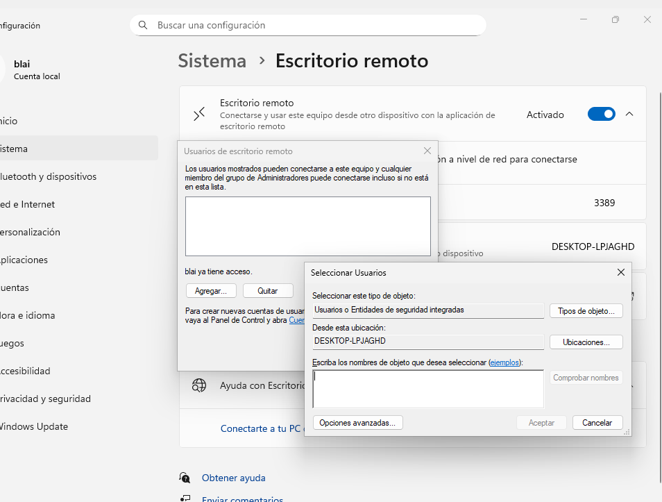

# T06: Accés remot - Escriptori remot (RDP)

Per realitzar aquesta pràctica necessitarem **dues màquines virtuals**: una amb Windows i una altra amb Zorin. Ambdues han d’estar configurades amb **xarxa NAT** perquè puguin comunicar-se entre elles dins la mateixa xarxa.

Abans de començar, farem **comprovacions inicials** utilitzant `ping`. Tingues en compte que cal **desactivar el firewall de Windows**, si no, la connexió no funcionarà correctament!

---

Com a primer pas, cal disposar d’una **màquina virtual amb Windows** i habilitar l’**escriptori remot**.  
Això es fa des de **Configuració → Sistema → Escriptori remot**.

---

A més, podrem **afegir usuaris d’escriptori remot**.

**IMPORTANT:** Cal crear un **nou usuari** per poder connectar-nos si no en tenim cap.  
Es pot fer des de:  
**Configuració → Comptes → Afegir un nou compte → Sense un compte de Microsoft**  
i seguir les instruccions que apareixen.

---
