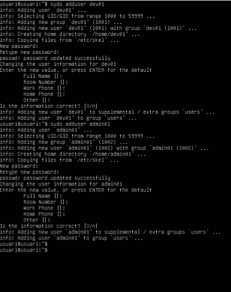
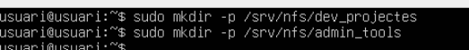
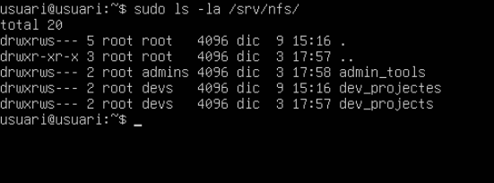

# 🖥️ T09: Servidor de fitxers Linux  
## NFS (Tasca Individual)

---

## 🛠️ Fase 1: Configuració de l'entorn

Actualitzem les dues màquines:

sudo apt update -y && sudo apt upgrade -y

Comprovarem que les dues màquines es veuen entre si amb un IP:

```
ip a

```


---

## 👥 Creació de grups al servidor

Crearem dos grups: `devs` i `admins`:

```
sudo groupadd devs  
sudo groupadd admins

```


---

## 👤 Creació d'usuaris

Crearem dos usuaris i els assignarem als grups corresponents:

sudo useradd -m -G devs dev01  
sudo useradd -m -G admins admin01



---

## 📁 Creació de directoris

Crearem els directoris `admin_tools` i `dev_projectes`:




---

## 🔒 Assignació de permisos

El grup `devs` tindrà control total sobre els seus projectes, i el grup `admins` tindrà control total sobre les seves eines.  
L’usuari propietari serà `root` en tots dos casos.


---

## 🔍 Comprovació de permisos

Utilitzarem la següent comanda per comprovar els permisos:

```bash
ls -la /srv/nfs/

```


---

