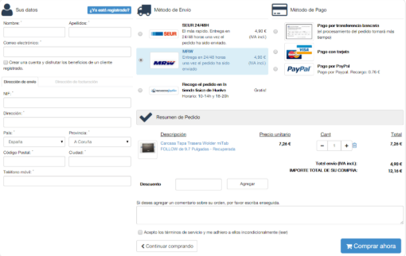

# T12: Fonaments del Disseny Web Comercial: Landing Page + Procés de Checkout

## Breu descripció

Classe magistral per explicar l’estructura de les pàgines web, en particular:  

- **Landing Page**  
- **Procés de Checkout**  

Abans de dissenyar la maqueta completa de l’e-commerce del client d’EverPia, cal entendre **els dos pilars essencials de qualsevol botiga online**.  

Aquesta tasca combina els conceptes fonamentals d’ambdós elements per oferir una **visió completa del recorregut de l’usuari**, des que arriba al web fins que finalitza la compra.

---

## Recursos

- **Enllaç a la presentació:** *(afegir enllaç si hi ha disponible)*  
- **Exemple de Landing Page:**  
  [Web amb landing page quilomètrica](https://romualdfons.com/monetizacion-webs/)  
- **Exemple de pantalles de Checkout:**  
  *(afegir imatges o captures de pantalla si disponibles)*

